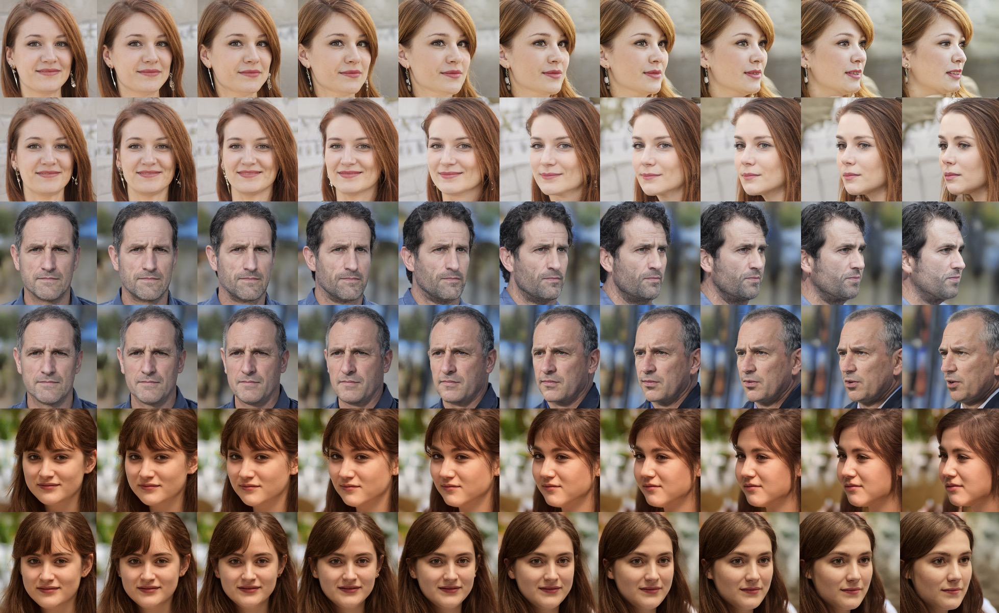

# Surrogate Gradient Field (SGF) for Latent Space Manipulation in Pytorch

This is an unofficial implementation of the paper ["Surrogate Gradient Field for Latent Space Manipulation (CVPR 2021)"](https://arxiv.org/abs/2104.09065) in Pytorch. Please notice that this implementation may differ in details compared to the original paper due to the empricial reasons.



The author leveraged diverse labels (e.g., age, gender, smile, ...) using [MS Face API](https://azure.microsoft.com/en-us/services/cognitive-services/face/). In the experiment, I only used pose values in a soft manner (0.0 ~ 1.0) for my own research. Empirically, the result shows a smooth transition compared to the manipulation learned by hard labels. I believe adding more labels as the authors did in their work will make the transition more robust (e.g., id or characteristics of the input image is sustained while manipulating it).


## Requirements
Please install the environment by running:
```
bash install.sh
```
- which will install libraries such as:
```
pip install tensorflow-gpu==1.15
conda install pytorch==1.7.1 torchvision==0.8.2 torchaudio==0.7.2 -c pytorch
pip install scipy>=0.17.0
pip install requests==2.22.0
pip install Pillow==6.2.1
pip install h5py==2.9.0
pip install imageio==2.9.0
pip install imageio-ffmpeg==0.4.2
pip install tqdm==4.49.0
pip install click pyspng ninja
pip install opencv-python
pip install scikit-image
pip install numba
```


## Run SGF
To see the manipulation result:
```
python sgf_pose.py --G_path 'path/to/generator.pkl' --SE_path 'path/to/se.pth' --AUX_path 'path/to/aux.pth' --save_result 1
```

---

## SGF step by step
SGF consists of multiple steps to follow. I will briefly introduce the concept of each step and the code to run respectively.

### Step 1: Sample image generation using StyleGAN2 [`x`]
- Generate 100K samples images using StyleGAN2 to train SENet
```
python generate.py --outdir=data/train/images --seeds=0,100000 --resize 256
python generate.py --outdir=data/val/images --seeds=100000,100500 --resize 256
python generate.py --outdir=data/test/images --seeds=100500,101000 --resize 256
```

### Step 2: Label images [`c`]
- Label images using Azure Face API / open source Face landmark detection algorithm to infer pose (yaw, roll, pitch)
```
python face_align.py --indir train
python face_align.py --indir val
python face_align.py --indir test
```

- If you want to see the landmark result
```
python face_align.py --indir test --plot 1
```

- Next, infer the face pose values (e.g., yaw, roll, pitch)
```
python pose_estimation.py --image_dir data/train/
python pose_estimation.py --image_dir data/val/
python pose_estimation.py --image_dir data/test/
```

- If you want to see the pose result
```
python pose_estimation.py --image_dir data/test/ --save_img 1
```

### Step 3: Fine-tune Squeeze and Excitation Network using images [`x`] and labels [`c`]
- Used is SE ResNet 50 pretrained on VGG Face2 dataset
```
python finetune_pose.py
python finetune_pose.py --mode test --model_path path/to/model.pth
```


### Step 4: Train Auxiliary (FC-layer) Network [`mapping: (z, c) -> z`]
- 6 FC layers for Z space, and 15 layers for W space
- AdaIN is used to mix features (`z` and `c`) in the same way as StyleGAN v1
- Refer to Appendix B in the paper

```
python fc_layer_pose.py --ckpt_dir 'path/to/save_dir'
python fc_layer_pose.py --mode test --ckpt_dir 'path/to/save_dir' --ckpt_fname 'filename.pth'
```


### Step 5: Calculate gradient in the surrogate gradient field and update [`z`]
- Refer to Algo 1 in the original paper
- Manipulate C to suit your purpose
```
python sgf_pose.py --G_path 'path/to/generator.pkl' --SE_path 'path/to/se.pth' --AUX_path 'path/to/aux.pth' --save_result 1
```


## Acknowledgement
Many thanks to the first author of the original paper, [Minjun Li](https://minjun.li/). The reproducing was not possible without Minjun's help.

## References
- [Li, M., Jin, Y., & Zhu, H. (2021). Surrogate Gradient Field for Latent Space Manipulation. In Proceedings of the IEEE/CVF Conference on Computer Vision ](https://arxiv.org/abs/2104.09065)


## Credits

**StyleGAN2-ADA:**  
https://github.com/NVlabs/stylegan2-ada-pytorch  
Copyright (c) 2021, NVIDIA Corporation  
NVIDIA Source Code License https://github.com/NVlabs/stylegan2-ada-pytorch/blob/main/LICENSE.txt   

**Face Alignment:**  
https://github.com/1adrianb/face-alignment  
Copyright (c) 2017, Adrian Bulat  
License (BSD 3-Clause) https://github.com/1adrianb/face-alignment/blob/master/LICENSE  

**VGG Face2 Datset & Squeeze and Excitation Network:**   
https://github.com/cydonia999/VGGFace2-pytorch  
Copyright (c) 2018 cydonia  
License (MIT) https://github.com/cydonia999/VGGFace2-pytorch/blob/master/LICENSE  